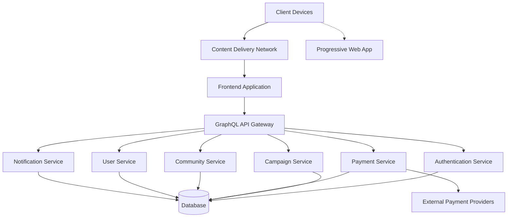
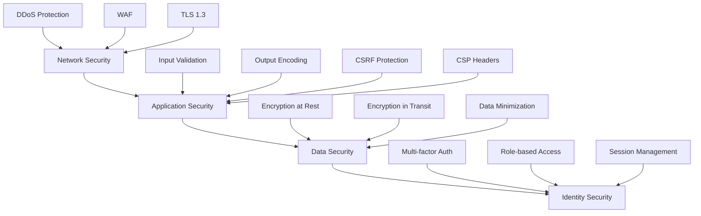
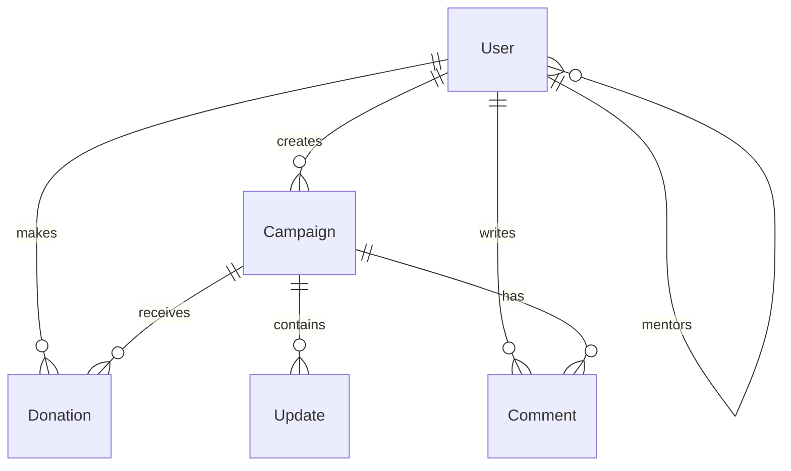
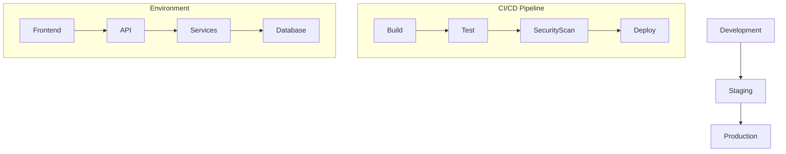
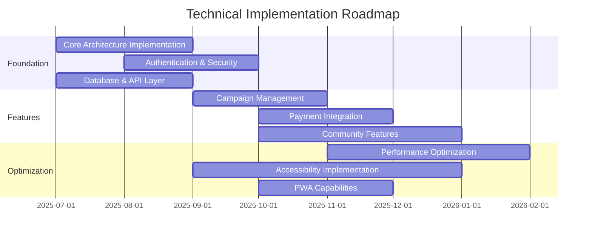

# Technical Architecture Blueprint for Merajut ASA

**Version:** 1.0  
**Date:** July 18, 2025  
**Author:** Farid-Ze (Tech Team)  
**Status:** Final Draft

## 1. Executive Summary

This Technical Architecture Blueprint defines the foundational technology framework for the Merajut ASA platform, ensuring alignment with our "Evolution, Not Revolution" philosophy and critical performance targets (<1.5s LCP, >95% WCAG compliance).

## 2. System Architecture Overview



### 2.1 Architecture Principles

- **Microservices-Based:** Domain-oriented services with clear boundaries
- **API-First:** GraphQL API gateway for optimized mobile data transfer
- **Cloud-Native:** Containerized services for scalability and reliability
- **Progressive Web App:** Offline capabilities and mobile optimization
- **Security by Design:** Security embedded at all architecture layers
- **Accessibility by Default:** Accessibility considerations in core components

## 3. Technology Stack Selection

| Component | Technology | Justification |
|-----------|------------|---------------|
| Frontend Framework | React with Next.js | Server-side rendering for performance, established ecosystem, PWA support |
| API Technology | GraphQL with Apollo | Optimized data transfer for mobile, flexible queries |
| Backend Services | Node.js (TypeScript) | Performance, ecosystem maturity, developer availability |
| Database | PostgreSQL (primary) | Relational integrity for financial transactions, ACID compliance |
| Database | MongoDB (community content) | Flexible schema for diverse community content |
| Caching | Redis | Performance optimization, session management |
| Search | Elasticsearch | Advanced search capabilities for community content |
| Content Delivery | Cloudflare CDN | Global performance, DDoS protection |
| Container Orchestration | Kubernetes | Scalability, service management |
| CI/CD | GitHub Actions | Automated testing, deployment, integration with repository |
| Monitoring | Prometheus & Grafana | Real-time performance monitoring, alerting |
| Performance Analytics | Custom Web Vitals implementation | Precise measurement of critical performance metrics |

## 4. Performance Architecture

### 4.1 Performance Budgets

| Metric | Budget | Enforcement Method |
|--------|--------|-------------------|
| JavaScript | 300KB (gzipped) | Webpack bundle analyzer, CI/CD checks |
| CSS | 50KB (gzipped) | PostCSS optimization, critical CSS extraction |
| Images | 500KB per page | Next.js Image optimization, WebP format |
| Fonts | 100KB total | Font subsetting, system font fallbacks |
| First-party JS execution | 350ms | Performance profiling, code splitting |
| Third-party JS execution | 200ms | Script loading optimization, vendor limits |
| API response time | 200ms | Performance monitoring, query optimization |

### 4.2 Critical Rendering Path Optimization

- Server-side rendering for initial page load
- Static generation for marketing pages
- Critical CSS inlining
- Deferred loading of non-critical resources
- Resource hints (preload, prefetch, preconnect)
- HTTP/2 for multiplexed connections

### 4.3 Mobile Optimization Strategy

- Mobile-first responsive design
- Adaptive loading based on network conditions
- Touch-optimized interfaces (minimum 44x44px tap targets)
- Reduced animations on low-end devices
- Optimized viewport configuration
- Device-appropriate image serving

## 5. Security Architecture

### 5.1 Security Layers



### 5.2 Authentication & Authorization

- OAuth 2.0 and JWT for authentication
- Role-based access control (RBAC)
- Session management with secure cookies
- Multi-factor authentication for sensitive operations
- Brute force protection with rate limiting

### 5.3 Payment Security

- PCI DSS compliance for payment processing
- Tokenization for payment information
- Integration with trusted Indonesian payment providers
- Transaction monitoring for fraud detection
- Secure refund and dispute processes

## 6. Database Architecture

### 6.1 Data Models



### 6.2 Database Strategy

- PostgreSQL for transactional data (users, donations, payments)
- MongoDB for flexible content (campaign stories, community posts)
- Database sharding strategy for future scale
- Read replicas for query performance
- Automated backup and disaster recovery

## 7. API Architecture

### 7.1 GraphQL Schema Design

```graphql
type Query {
  campaign(id: ID!): Campaign
  campaigns(filter: CampaignFilter): [Campaign!]!
  user(id: ID!): User
  communityActivity(filter: ActivityFilter): [Activity!]!
}

type Mutation {
  createCampaign(input: CampaignInput!): Campaign
  donate(input: DonationInput!): Donation
  updateProfile(input: ProfileInput!): User
  engageCommunity(input: EngagementInput!): Activity
}
```

### 7.2 API Design Principles

- GraphQL for flexible data fetching
- Rate limiting to prevent abuse
- Depth limiting for query complexity
- Persisted queries for performance
- Automatic documentation generation
- Versioning strategy for API evolution

## 8. Frontend Architecture

### 8.1 Component Structure

```
├── components/
│   ├── common/            # Shared UI components
│   │   ├── Button/
│   │   ├── Form/
│   │   └── Navigation/
│   ├── campaign/          # Campaign-specific components
│   ├── community/         # Community engagement components
│   ├── donation/          # Donation flow components
│   └── user/              # User profile components
├── pages/                 # Next.js pages
├── hooks/                 # Custom React hooks
├── context/               # React context providers
├── utils/                 # Utility functions
└── styles/                # Global styles and theme
```

### 8.2 State Management

- React Context for global state
- Apollo Client for GraphQL data
- React Query for server state management
- Local storage for persistent user preferences
- Redux for complex state interactions

### 8.3 PWA Implementation

- Service worker for offline capabilities
- App manifest for installation experience
- Cache strategies for different resource types
- Background sync for offline actions
- Push notifications for engagement

## 9. Accessibility Implementation

### 9.1 Accessibility Standards

- WCAG 2.1 AA compliance target (>95%)
- Semantic HTML throughout the application
- ARIA attributes where native semantics are insufficient
- Keyboard navigation for all interactive elements
- Screen reader compatibility for critical user journeys
- Color contrast meeting AA requirements (4.5:1 for normal text)

### 9.2 Accessibility Testing Framework

- Automated testing with axe-core
- Manual testing with NVDA, JAWS, and VoiceOver
- Regular accessibility audits
- User testing with people with disabilities
- Accessibility included in definition of done

## 10. Deployment Architecture

### 10.1 Infrastructure



### 10.2 Deployment Strategy

- Infrastructure as Code using Terraform
- Blue-green deployment for zero downtime
- Canary releases for risk mitigation
- Automated rollback capabilities
- Multi-region deployment for disaster recovery

## 11. Monitoring and Observability

- Real User Monitoring (RUM) for performance tracking
- Centralized logging with ELK stack
- Distributed tracing with OpenTelemetry
- Custom dashboards for key metrics
- Automated alerting for performance and availability issues

## 12. Technical Debt Management

- Regular refactoring sprints
- Code quality metrics in CI pipeline
- Documentation requirements for all components
- Technical debt inventory and prioritization
- Architecture decision records (ADRs)

## 13. Scalability Considerations

- Horizontal scaling of services
- Database sharding for data growth
- CDN for static content delivery
- Caching strategies at multiple levels
- Load testing to identify bottlenecks

## 14. Implementation Roadmap



## 15. Appendices

### 15.1 Technology Evaluation Matrix

| Technology | Performance | Accessibility | Security | Developer Availability | Community Support | Decision |
|------------|-------------|--------------|----------|------------------------|-------------------|----------|
| React vs Vue | ⭐⭐⭐⭐ | ⭐⭐⭐⭐ | ⭐⭐⭐ | ⭐⭐⭐⭐⭐ | ⭐⭐⭐⭐⭐ | React |
| REST vs GraphQL | ⭐⭐⭐ | ⭐⭐⭐ | ⭐⭐⭐ | ⭐⭐⭐⭐ | ⭐⭐⭐⭐ | GraphQL |
| PostgreSQL vs MySQL | ⭐⭐⭐⭐ | N/A | ⭐⭐⭐⭐ | ⭐⭐⭐⭐ | ⭐⭐⭐⭐ | PostgreSQL |
| MongoDB vs DynamoDB | ⭐⭐⭐⭐ | N/A | ⭐⭐⭐ | ⭐⭐⭐⭐⭐ | ⭐⭐⭐⭐⭐ | MongoDB |

### 15.2 Performance Testing Strategy

Comprehensive performance testing methodology including:
- Synthetic testing with Lighthouse and WebPageTest
- Real User Monitoring with custom Web Vitals implementation
- Load testing with k6
- Performance testing across various device types and network conditions

## 16. Conclusion

This Technical Architecture Blueprint provides a comprehensive framework for building the Merajut ASA platform with performance, accessibility, and security as foundational elements. By following the architecture outlined here, we will create a platform that embodies our "Evolution, Not Revolution" philosophy while meeting our critical technical targets.